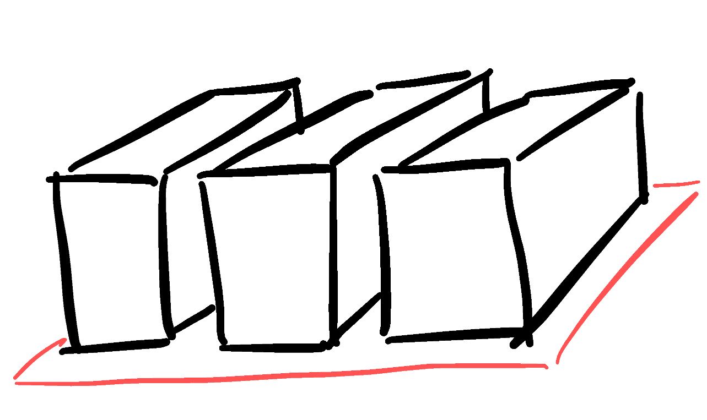

At first there was the *monolith* running on bare-metal. Code revisions for this monstrosity were few and far between. Apart from being resource in-efficient, updating such an application required manual intervention and more often than not, *downtime*. Scaling these application was also not a trivial task. Generally, scaling required that the infrastructure that the application is running on, be scaled vertically. Which is again, in-efficient and costly.

Monolith

Then came containers and made code packaging and deployment more repeatable. As opposed to the *monolith*, they also enabled a more distributed model for applications which we now call as *Microservices Architecture*. This meant that application code could be revised with a greater velocity, only focusing on the services that warranted an upgrade. And since, these services are already containerized, putting a load-balancer upfront with an auto-scaling pool of these containers was also in the realm of convinient possibilities. This is the model that is widely being used today. Tools and services like Kubernetes, Elastic Container Service, EKS, Google Kubernetes Engine provide a seamless solution for deploying containerzied applications which are capable of auto-scaling, auto-healing and rolling updates.

Micro-services

For future, the trend is shifting towards *serverless servers*. There are multiple FaaS platforms that allow an application to be made up of component functions. There is no need of manually managing the infrastructure that the application is running on. The application is completely decoupled from the underlying hardware infra. These functions are only executed/instantiated on request. Therefore there is no *server* running continuosly in the traditional sense, waiting for traffic. Services like Cloud Functions in GCP and Lambda in AWS are two examples of this architecture. FaaS enables pay-per-use model for billing. It also greatly helps CI/CD mechanisms.

Functions

