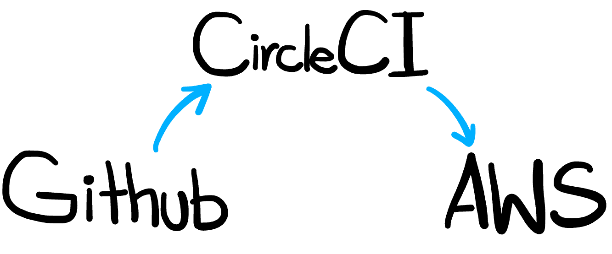
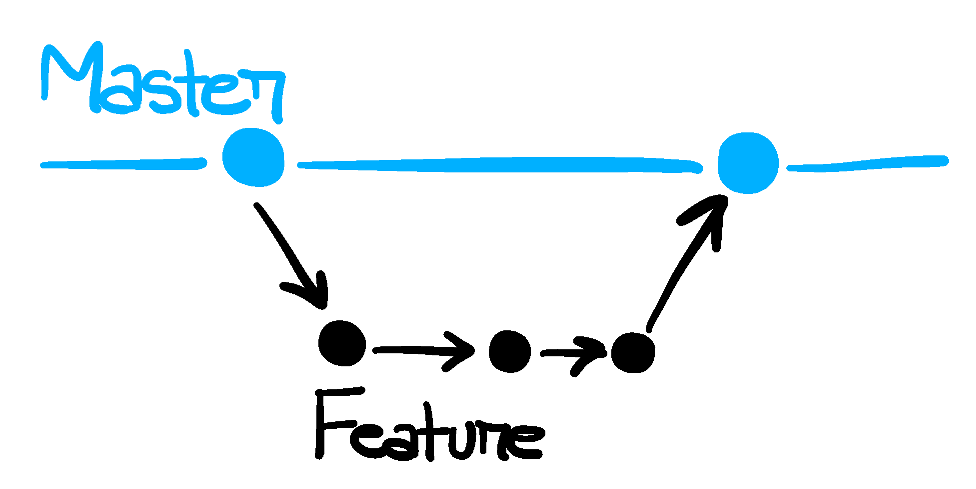
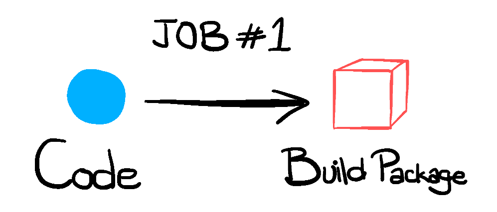
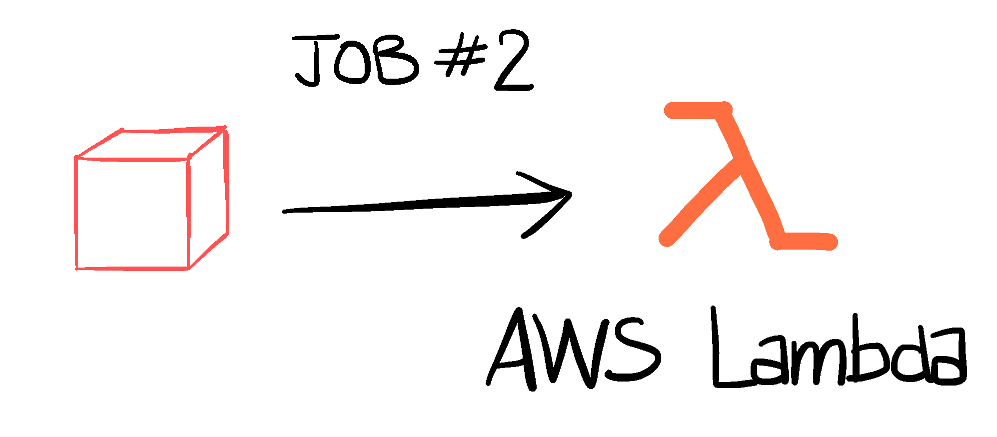

Continuous Integration & Continuous Deployments are the philosphies that dictate that changes in a software project should be made more *often*. Commits should be tested automatically, merged in a branch and should result in some form of a running application environment **without** any manual intervention. Gone are the days of merging changes once a month, now it is recommended to have changes merged multiple times *per day*. With design principles like micro-services and increasing popularity of serverless architectures, CI & CD have become a very important topic in software development.

From source code to an application running in a production environment. That is the goal of this blog post. We will develop a completely automated pipeline for deploying a simple JavaScript application into a production ready environment on AWS that is highly available and highly scalable. All of this will be done without ever handling the infrastructure manually.


<div align="center">

<div>Overview of the CD pipeline</div>
</div>


Our source code lives on GitHub and we want to deploy it on AWS Lambda. We will use CircleCI to generate an automated build of our application whenever there is a new merge on the master branch. After the build has finished, we can trigger another job that will transport the build file to AWS and deploy it on Lambda. It is important to note that similar workflow could easily be developed on top of other DevOps tools like Jenkins, TravisCI, BitBucket, etc.


# Trigger


<div align="center">

</div>

GitHub provides a Webhook feature which can be used to call external services whenever an event occurs on a GitHub repository. CircleCI can use this webhook to register itself as a consumer of different events.

We will trigger our CircleCI workflows on the event of a *merge* in the master branch.

# Build
<div align="center">

</div>

At this point, our code has passsed different unit and integration tests and has now been merged into the master branch. Now, we can make a build of the project which can then be deployed into a production environment.

AWS Lambda CLI expects a zip file of the project in order to update the production version. So our Job#1, named `build` is to zip the project source code into a single zip file. To do this, we have to add the following job in our `.circleci/config.yml` file.

```
build:
    docker:
      - image: circleci/node:7.10
    working_directory: ~/repo
    steps:
      - checkout

      # Download and cache dependencies
      - restore_cache:
          keys:
          - v1-dependencies-{{ checksum "package.json" }}
          # fallback to using the latest cache if no exact match is found
          - v1-dependencies-

      - run: npm install --only=prod

      - save_cache:
          paths:
            - node_modules
          key: v1-dependencies-{{ checksum "package.json" }}

      # Zip the project directory
      - run: npm run zip

      - store_artifacts:
          path: ./build/bender.zip
          destination: bender_lambda.zip

      # Cache the build folder for the deploy job
      - save_cache:
          key: v1-build-{{ .Environment.CIRCLE_BRANCH }}-{{ .Environment.CIRCLE_SHA1 }}
          paths:
              - build
```

# Deploy
<div align="center">

</div>

Now that the zip file has been created, we can upload it to AWS. Our Job#2, named `deploy` does exactly that.

In order to upload the zip file to AWS, we will be using the AWS CLI. I created a Docker image that comes with this tool pre-installed, so that I dont have to install it manually everytime my pipeline runs. I hosted it on Dockerhub as well so that I can directly pull it from there in my CircleCI pipelines. Note the `abdulah/awscli:latest` image in the `docker` section.

I created a new user in AWS IAM for the CircleCI pipelines. I gave this user programmatic access to the AWS Account and only full access to the AWS Lambda service. It does not have any access to the other services in my account. I had to add the `ACCESS_KEY_ID` and `SECRET_ACCESS_KEY` of this user in my CircleCI project settings under 'AWS Permissions'. What this does is create the two environment variables inside every container that is spawned for this project. These variables are then used by the AWS CLI to connect to the corresponding account and manage the associated services.

```
deploy:
    docker:
      - image: abdulah/awscli:latest
    working_directory: ~/repo
    steps:

      # Restore cache from the build job which contains the
      # build folder that needs to be deployed
      - restore_cache:
          key: v1-build-{{ .Environment.CIRCLE_BRANCH }}-{{ .Environment.CIRCLE_SHA1 }}

      # Update the Lambda function
      - run:
          name: Updating randomFuturama
          command: aws lambda update-function-code --function-name randomFuturama --zip-file fileb:///home/circleci/repo/build/bender.zip
```

# Workflow

Now, we want to define a workflow that is constitued of both of the above jobs. This workflow can be triggered on the *merge* event so that it builds and deploys our updated Lambda function on AWS. The restriction of the workflow to a specific branch is also done here.

```
workflows:
  version: 2
  build_and_deploy:
    jobs:
      - build:
          filters:
            branches:
              only: master
      - deploy:
          filters:
            branches:
              only: master
          requires:
            - build
```

At the end of the day, the `.circleci/config.yml` file should look something like [this](https://github.com/ahsan/bender/blob/master/.circleci/config.yml).


And that's it! Now you have a fully automated pipeline that deploys your AWS Lambda function whenever a new version is available on the master branch in your VCS.


# Footnotes

- The GitHub project that is being deployed by this pipeline can be found at [github.com/ahsan/bender](https://www.github.com/ahsan/bender).
- The application can be accessed on this [link](https://8vm545tod0.execute-api.us-east-1.amazonaws.com/production).