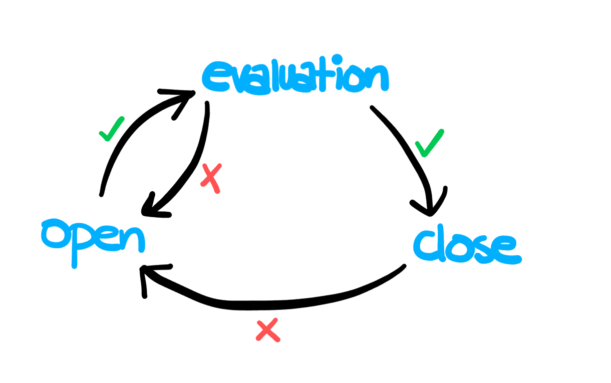

Contrary to popular belief, failure is always an option. Totally reasonable in certain circumstances, as well. There exists no such thing as a perfect service. Every service will experience downtimes at different points in its life; under peak traffic, due to hardware failure or even caused by network partition. It is much better to prepare and opt for a graceful failure whenever appropriate. *Failing fast* is a very important and interesting concept in the world of microservices.

In electronics, *circuit breaking* is the process of cutting the path of electrical current in case of a single component failure. Doing this protects other parts of the circuit from following suit. Similarly, in microservice meshes, circuit breaking refers to the elimination of individual service hosts from work whenever they fall into a bad state. Denying traffic to bad hosts not only protects the consumers of the service from indefinite wait but also prevents the failure from cascading into other parts of the complete services mesh. Circuit breaking enables resilient microservice applications.

Netflix has battle-tested the ciruit breaker pattern in production. The [Hystrix](https://github.com/Netflix/Hystrix) library has been the enabler of circuit breaking in the video giant's global scale production service mesh.

Circuit breaking dictates that a service host (generally a container) needs to be denied traffic for a certain amount of time if it goes into a bad state. Instead, all the traffic is routed to other hosts in the loadbalancing pool. After a certain waiting time, the host is checked again for its health. If it has recovered, traffic is restored to it gradually. But if it has not, the cycle continues. The state transition process is illustrated in the image below.

<div align="center">

</div>

In a service mesh, lagging containers are worse than altogether dead ones. More often than not, these containers are hogging up all the physical resources (hopefully to a predefined [resource limit](https://kubernetes.io/docs/concepts/configuration/manage-compute-resources-container/)). The delay caused by them is cascaded back to the calling services. On top of that, retrying requests makes things even worse.

Like many other awesome features, Istio comes with the circuit breaker pattern baked right in. It uses the *DestinationRule* objects for its configuration. An [example](baseEjectionTime) circuit-breaker config is copied below:

```yaml
apiVersion: networking.istio.io/v1alpha3
kind: DestinationRule
metadata:
  name: foo-circuitbreaker
spec:
  host: foo
  trafficPolicy:
    connectionPool:
      http:
        http1MaxPendingRequests: 1
        maxRequestsPerConnection: 1
    outlierDetection:
      consecutiveErrors: 1
      interval: 10s
      baseEjectionTime: 3m
      maxEjectionPercent: 100
```

The above rule is named as 'foo-circuitbreaker' and applies to the 'foo' upstream service. The meaning of various parameters used in this example are listed in the following table

Parameter | Description
--- | ---
**connectionPool** | The settings defined under this section are applied to each and every host in the upstream service.
**http1MaxPendingRequests** | The maximum number of pending requests to a destination.
**maxRequestsPerConnection** | Setting this to 1 disables keep-alive.
**outlierDetection** | These settings identify the bad-state containers.
**consecutiveErrors** | Number of 5xx or timeout errors before a host is ejected from the connection pool.
**interval** | Time interval between ejection sweep analysis.
**baseEjectionTime** | The minimum duration of time for which the host is ejected.
**maxEjectionPercent** | The maximum percentage of the load-balancer pool containers that can be ejected at a time.

### Reading resources:
1. Istio [documentation](https://istio.io/docs/reference/config/istio.networking.v1alpha3/#ConnectionPoolSettings).
2. Red Hat Developer [blog post](https://developers.redhat.com/blog/2018/03/27/istio-circuit-breaker-when-failure-is-an-option/).