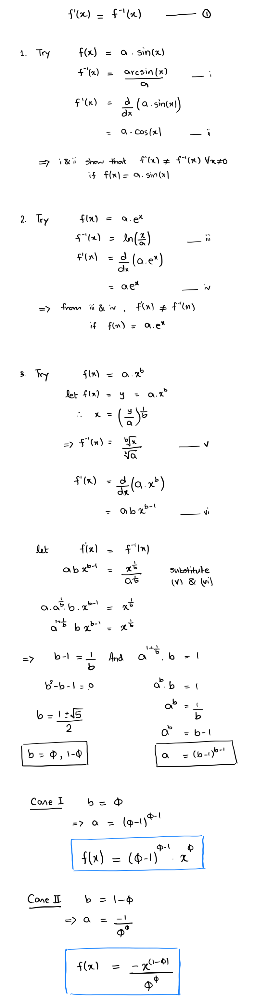

As is the case with majority of my blog posts, this one is also an answer to a question that spontaneously popped up in my head one day: "Are there any functions that have the same inverse function as their first derivative?"

Spoiler alert: there are atleast two and, they're based on the golden ratio!

## Derivation

    

## Plot

    <iframe src="https://www.desmos.com/calculator/cd7vadnuiw?embed" width="500px" height="500px" style="border: 1px solid #ccc" frameborder="0">foobar</iframe>

