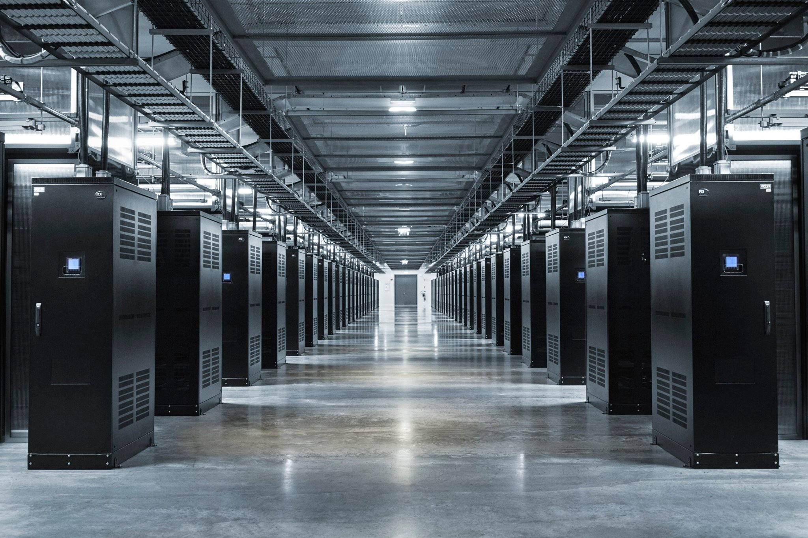
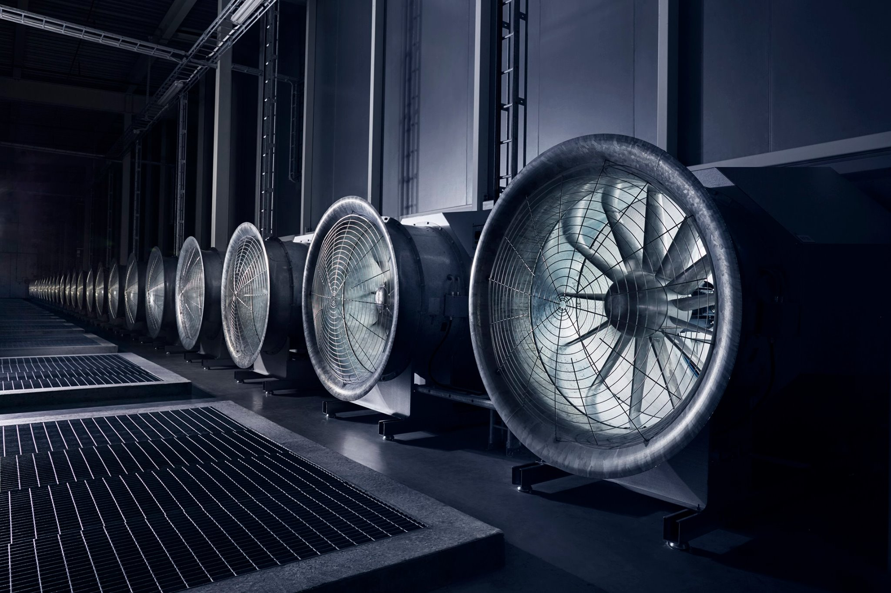

The World runs on technology. Modern society functions on the assumption that technology just works. Tech keeps our airplanes in the sky and our people across the globe in touch. When it works, we can have a pair of socks delivered at the doorstep and when it fails, a rocket explodes in mid-air. The bedrock of modern society is technology. This blog-post however isn't about how tech runs the world, instead it's about how the world runs tech. It explores the infrastructure behind all of the monstrosity that we call the *Internet*. The image above is from one of the server farms that belong to Google in Finland. There are thousands of such computer clusters scattered across the globe that power today's technology.

So what is 'tech' anyways? In very abstracted terms, it is just a huge network of individual computers that run some sort of a software and communicate with each other. All of the online applications that we use everyday and take for granted are running somewhere on the Internet on some computer. Examples include Google Search, Siri, YouTube, Email, etc. All of the Internet connected devices and services are fetching and providing data to computers running in some sort of a server cluster. According to conservative estimates, there are well over a million servers that power the different services offered by Google alone. There are other tech giants like Amazon, Apple, Facebook, Microsoft, Netflix,  etc. that have their own goliath server infrastructures.

One of Facebook's data centers in Luleå, Iceland.

A data center has hundreds of thousands of individual computers (aka servers) placed together. They are generally organized into rows where each row has multiple racks. One rack can contain tens of servers and additional networking hardware. Running so many computers in such a high density requires a huge amount of power and generates a lot of heat. All of these data centers have elaborate systems to power-up and cool down the servers they contain. Google has built some data centers that run totally off of renewable energy. The image below shows the cooling fans inside one of Facebook's server farms.

One of Facebook's data centers in Luleå, Iceland.

Management of such a large number of computers that are all placed at one location becomes a big challenge. Every computer may want to be able to talk to every other computer and run some form of a service. There may arise a case where it is needed to make a smaller logical section that is isolated from the complete network. Apart from the networking complexities, there may also arise a need to add more computers to the cluster and the network. In order to make the management of adding and removing servers from a cluster easier, more often than not, the compute power of a server farm is virtualized. The bare-metal of a physical machine is never utilized as is. Instead virtual machines are spun up on top of physical hardware that are then used to run different services. The system software that is responsible for management of this virtual layer is known as a *Hypervisor*. Different companies use different hypervisors. Google and AWS use the KVM hypervisor for Compute Engine and EC2 respectively.

Now, just the virtualization of compute power isn't enough. In order to make the application software layer more efficient, recently another layer of abstraction has been introduced. Applications are *containerized* and orchestrated using tools like Kubernetes and Mesos. Which provide added benefits like fast auto-scaling, fault tolerance and seamless updates. You can learn more about Kubernetes from one of my [older blog-posts](https://ahsan.io/2018-11-15-why-kubernetes/) on this subject.

All in all, tech has become an integral part of modern way of life. It takes a massive amount of physical and software infrastructure to run it. And we're getting better at it by the day!

## Footnotes
- Image sources: Mark Zuckerberg's [Facebook post](https://www.facebook.com/zuck/posts/10103136694875121) and [Google Datacenters](https://www.google.com/about/data centers/) website.