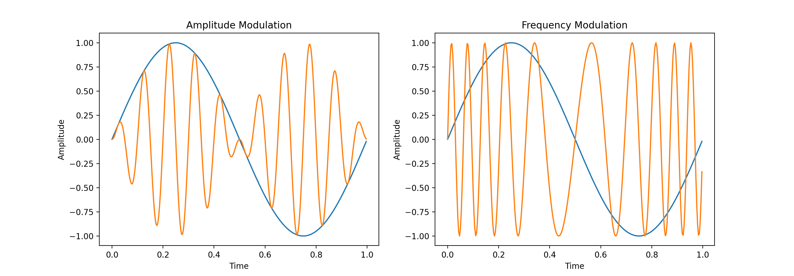
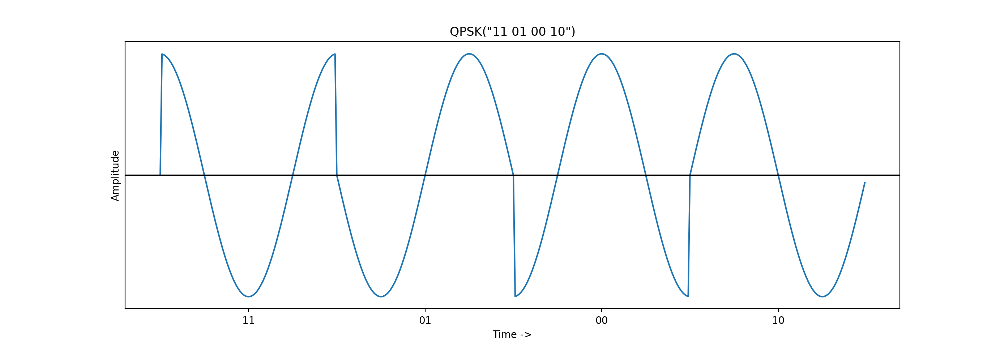

I was watching a [video](https://www.youtube.com/watch?v=TNQsmPf24go) on YouTube about the Internet's networking infrastructure, and it got me thinking: "What is the modulation method used by modern electronic devices to communicate with networking hardware?". The pursuit of an answer took me deep into the rabbit-hole that is communication theory.

> TL;DR: WLAN 802.11 b/g standards use various PSK schemes; QPSK, BPSK being among them.

## FM and AM

For communication of analog signals, the two most popular modulation methods are FM (frequency modulation) and AM (amplitude modulation). This is the communication method still in use by the commercial analog radio today. The names of these methods are pretty self-explanatory. In each case, the amplitude of the input signal changes the corresponding attribute of the carrier wave. This can be easily observed in the following figure where blue wave is the input signal and the orange one is the output.

```python
import numpy as np
import matplotlib.pyplot as plt

f_carrier = 10
w_carrier = 2 * np.pi * f_carrier
f_input = 1
w_input = 2 * np.pi * f_input


time_granularity = 1/300
time = np.arange(0, 1, time_granularity)
input_signal = np.sin(np.multiply(time, w_input))

am_output_signal = np.multiply(
    np.sin(np.multiply(time, w_carrier)), input_signal)

fm_output_signal = np.zeros_like(time)
for i, t in enumerate(time):
    fm_output_signal[i] = np.sin(
        2. * np.pi * (f_carrier * t + input_signal[i]))

plt.subplot(1, 2, 1)
plt.plot(time, input_signal)
plt.plot(time, am_output_signal)
plt.title('Amplitude Modulation')
plt.xlabel('Time')
plt.ylabel('Amplitude')

plt.subplot(1, 2, 2)
plt.plot(time, input_signal)
plt.plot(time, fm_output_signal)
plt.title('Frequency Modulation')
plt.xlabel('Time')
plt.ylabel('Amplitude')

plt.show()

```

<div align="center">
    
</div>

## QPSK

In case of digital signals, FM and AM just become Frequency-shift keying (FSK) and Amplitude-shift keying (ASK) because of the discrete jumps in the input signal.

Phase-shift keying (PSK) is another modulation method that, as its name suggests, modulates the phase of the carrier wave depending on the amplitude of the input signal. This is the method that is mostly used by digital electronics for wired and wireless communication. Various PSK schemes are used by the WLAN 802.11 b/g standards depending on the data rate requirements. Other applications include RFID, biometric passports, wireless credit cards, etc.

PSK trades off error probability for more bandwidth. Compared with Frequency-shift keying, PSK has more bandwidth whereas FSK has better noise rejection for the same signal power.

Quadrature phase-shift keying (QPSK) imposes 4 symbols on the carrier wave, and hence, can encode 2 bits of information per symbol. It's known as "quadrature" PSK because, in addition to the "in-phase" component, it also has an orthogonal "in-quadrature" component in the carrier wave. What this means is that the carrier wave is a combination of a sine and a cosine component. This idea gets more understandable in the QPSK example encoding below:

```python
import numpy as np
import matplotlib.pyplot as plt

freq = 1
w = 2 * np.pi * freq
symbol_phase_angles = [np.pi/4, 3*np.pi/4, 5*np.pi/4, 7*np.pi/4]

time_granularity = 1/100
time = np.arange(0, len(symbol_phase_angles), time_granularity)
signal = np.zeros(len(time))

for phase_ind, phase in enumerate(symbol_phase_angles):
    start = int(phase_ind/time_granularity)+1
    end = int((phase_ind + 1)/time_granularity)
    time_slice = time[start:end]
    signal[start:end] = np.sin(np.multiply(time_slice, w) + phase) + \
        np.cos(np.multiply(time_slice, w) + phase)

plt.plot(time, signal)

plt.title('QPSK("11 01 00 10")')
plt.xlabel('Time ->')
plt.ylabel('Amplitude')

plt.yticks(np.array([]))
plt.xticks([i + freq/2 for i in range(len(symbol_phase_angles))],
           ['11', '01', '00', '10'])

plt.axhline(y=0, color='k')
plt.show()
```

<div align="center">
    
</div>

As you can see, the start of each symbol has a jump in the phase of the modulated signal. The demodulator at the receiving end of this signal would have prior knowledge of the phase-to-symbol mapping, and in this way would be able to understand the message that was encoded.
